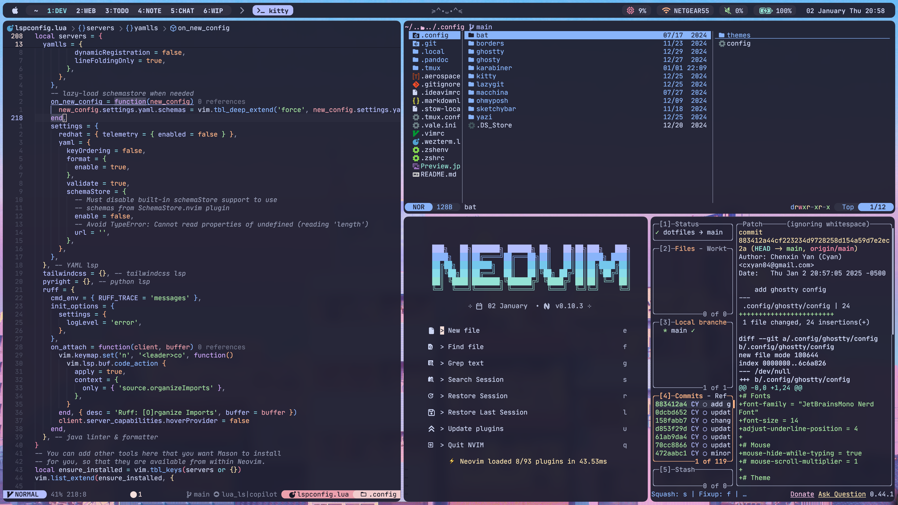

# Dotfiles

A minimal catppuccin setup. Dotfiles are managed using `stow`.



## Dependencies

1. A terminal supports 256-color such as [iTerm2](https://iterm2.com/index.html)
2. Using `zsh`
3. A [nerd font](https://www.nerdfonts.com) (I personally use JetBrainsMono Nerd Font)
4. Homebrew and required packages

```bash
/bin/bash -c "$(curl -fsSL https://raw.githubusercontent.com/Homebrew/install/HEAD/install.sh)"
brew install git
brew install stow
```

## Installation

```bash
git clone git@github.com:chenxin-yan/dotfiles.git ~/
cd ~/dotfiles
stow .
```

## Setup & configuration

1. install terminal emulation: [ghostty](https://ghostty.org/docs/install/binary)
2. install Plugin manager: [zinit](https://github.com/zdharma-continuum/zinit)
3. install prompt theme engine: [Oh My Posh](https://ohmyposh.dev/docs/installation/macos)
4. install flag completion: [carapace](https://carapace-sh.github.io/carapace-bin/install.html)
5. install fuzzy finder: [fzf](https://github.com/junegunn/fzf)
   - install [fd](https://github.com/sharkdp/fd) to replace `find`
   - install [ripgrep](https://github.com/BurntSushi/ripgrep?tab=readme-ov-file#installation)
6. install session manager: [zellij](https://zellij.dev/)
7. install git TUI: [lazygit](https://github.com/jesseduffield/lazygit)
8. install git diff highlighter: [git-delta](https://dandavison.github.io/delta/installation.html)
9. install jj: [jj](https://github.com/jj-vcs/jj) and [lazyjj](https://github.com/Cretezy/lazyjj)
10. install docker TUI: [lazydocker](https://github.com/jesseduffield/lazydocker)
11. install karabiner for key motification
12. install editor: [neovim](https://neovim.io)
    - download my nvim [config](https://github.com/chenxin-yan/nvim) and follow setup instructions
    - (optional) download neovide as nvim GUI: [neovide](https://neovide.dev)
13. install better ls: [Eza](https://github.com/eza-community/eza/blob/main/INSTALL.md)
14. install better cd: [Zoxicde](https://github.com/ajeetdsouza/zoxide)
15. install better cat: [Bat](https://github.com/sharkdp/bat)
16. Install tiling window manager: [aerospace](https://github.com/nikitabobko/AeroSpace)
17. install [sketchybar](https://felixkratz.github.io/SketchyBar/setup)
    - install [SF Symbals](https://developer.apple.com/sf-symbols/) for macos native symbals
    - install [sketchybar-app-font](https://github.com/kvndrsslr/sketchybar-app-font)
18. install terminal file explorer: [yazi](https://yazi-rs.github.io)
    - install clipboard CLI: [Clipboard](https://github.com/Slackadays/ClipBoard)
19. install file converter: [pandoc](https://pandoc.org)
    - template for pdf generation: [Eisvogel](https://github.com/Wandmalfarbe/pandoc-latex-template)
    - install [BasicTex](https://tug.org/mactex/morepackages.html)
    - install [Better BibTex for Zotero](https://retorque.re/zotero-better-bibtex/)
    - install [wkhtmltopdf](https://wkhtmltopdf.org/downloads.html)
20. Install GitHub CLI: [gh](https://cli.github.com)
    - install [gh-dash](https://github.com/dlvhdr/gh-dash)
21. install [curlie](https://github.com/rs/curlie)
22. install database management: [rainfrog](https://github.com/achristmascarl/rainfrog)
23. (Optional) Install system info fetcher: [macchina](https://github.com/Macchina-CLI/macchina)

## Environmental Variables

- `VAULT_PATH`: directory for notes
- `DEV_DIR`: directory for any development projects
- `PROJECT_DIR`: Directory for any non-development projects
- `AREA_DIR`: Directory for files/documents
