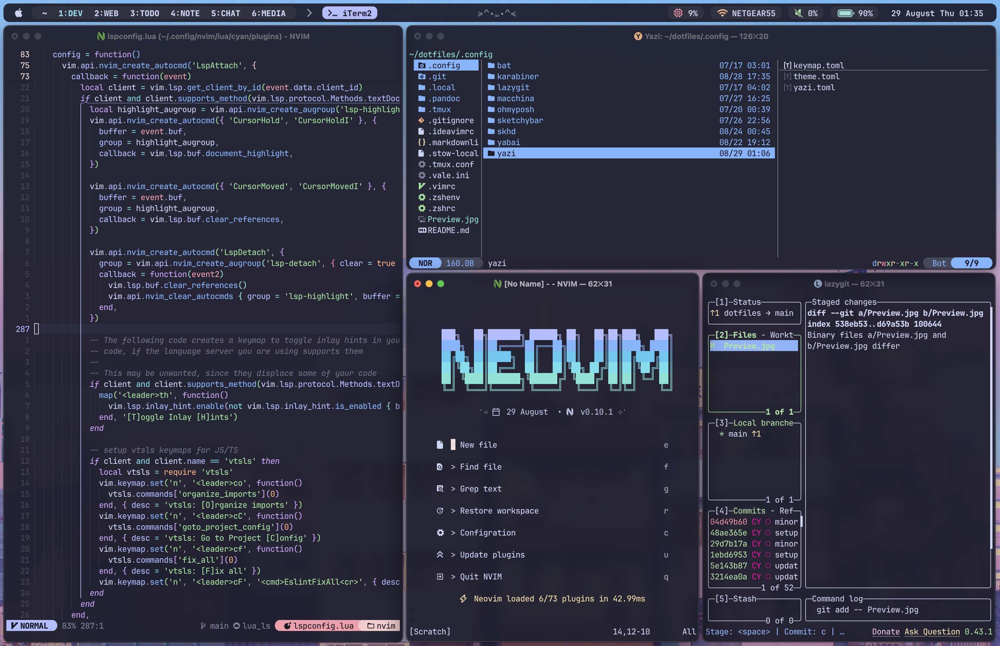

# Dotfiles

A minimal catppuccin setup. Dotfiles are managed using `stow`.



## Dependencies

1. make sure you are using a terminal support 256-color such as [iTerm2](https://iterm2.com/index.html)
2. make sure you are using `zsh`
3. Install a [nerd font](https://www.nerdfonts.com) (I personally use JetBrainsMono Nerd Font)
4. Install Homebrew and required packages

```zsh
/bin/bash -c "$(curl -fsSL https://raw.githubusercontent.com/Homebrew/install/HEAD/install.sh)"
brew install git
brew install stow
```

## installation

```zsh
git clone git@github.com:chenxin-yan/dotfiles.git ~/
cd dotfiles
$ stow .
```

## Setup & Configuration

1. install Plugin manager: [zinit](https://github.com/zdharma-continuum/zinit)
2. install prompt theme engine: [Oh My Posh](https://ohmyposh.dev/docs/installation/macos)
3. install fuzzy finder: [fzf](https://github.com/junegunn/fzf)
   - install [fd](https://github.com/sharkdp/fd) to replace `find`
4. install session manager: [tmux](https://github.com/tmux/tmux)
   - install [tpm](https://github.com/tmux-plugins/tpm)
   - use `<prefix>I` to install plugins
   - [cheetsheet](https://tmuxcheatsheet.com) for tmux command
5. install editor: [neovim](https://neovim.io)
   - download my nvim [config](https://github.com/chenxin-yan/nvim) and follow setup instructions
   - (optional) download neovide as nvim GUI: [neovide](https://neovide.dev)
6. install git CLI: lazygit
7. (Optional) install karabiner for key motification
8. install better ls: [Eza](https://github.com/eza-community/eza/blob/main/INSTALL.md)
9. install better cd: [Zoxicde](https://github.com/ajeetdsouza/zoxide)
10. install better cat: [Bat](https://github.com/sharkdp/bat)
11. Install tiling window manager: [Yabai](https://github.com/koekeishiya/yabai)
    - Install [skhd](https://github.com/koekeishiya/skhd) for window management shortcuts
12. install [sketchybar](https://felixkratz.github.io/SketchyBar/setup)
    - install [SF Symbals](https://developer.apple.com/sf-symbols/) for macos native symbals
    - install [sketchybar-app-font](https://github.com/kvndrsslr/sketchybar-app-font)
